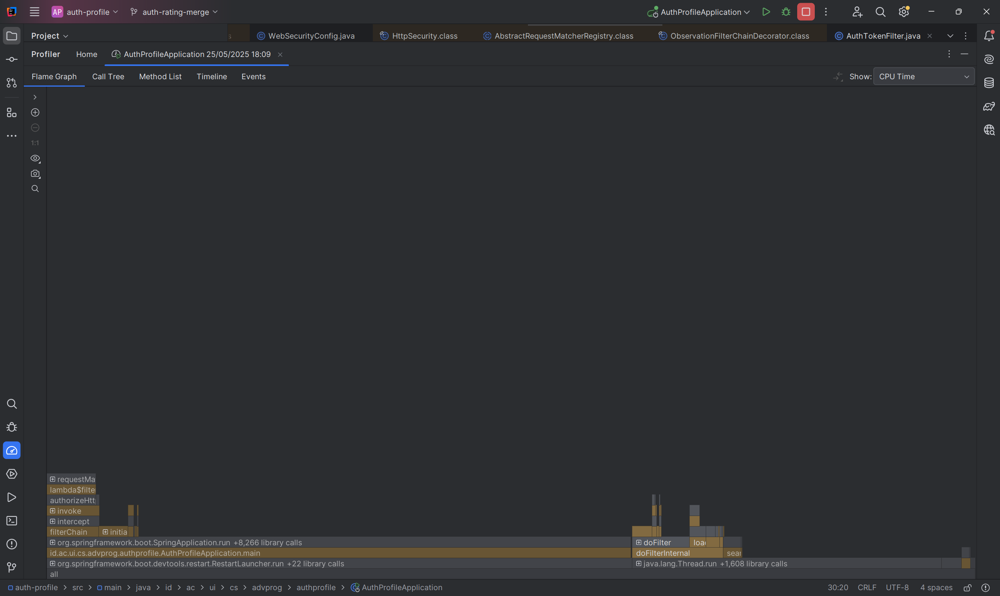
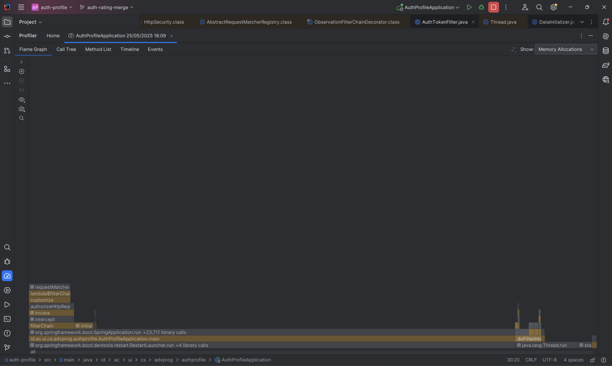
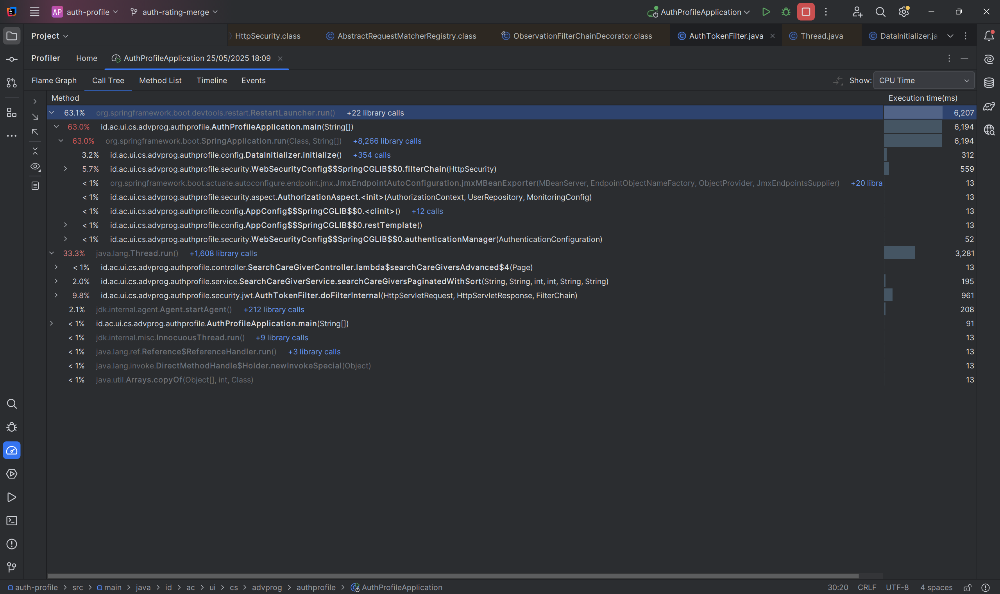

# Profiling

Berdasarkan hasil profiling IntelliJ Profiler, aplikasi auth-profile menunjukkan beberapa area yang memerlukan optimisasi. Startup time aplikasi mencapai 6.2 detik dengan 63.1% CPU time dihabiskan untuk inisialisasi Spring Framework dan dependency injection (+8,266 library calls), menunjukkan overhead yang signifikan pada fase startup. Security configuration memerlukan 559ms (5.7% CPU) yang berdampak pada setiap request, terutama pada proses authentication dan JWT token processing. DataInitializer menghabiskan 312ms untuk database initialization, sementara search operations hanya memerlukan <1% CPU time yang menunjukkan implementasi async sudah berjalan optimal.

**Justifikasi Penggunaan IntelliJ Profiler:** IntelliJ Profiler dipilih karena beberapa keunggulan yang sangat cocok untuk profiling aplikasi Spring Boot ini. Pertama, **seamless integration** dengan development environment memungkinkan profiling langsung dari IDE tanpa setup tambahan, sehingga developer dapat dengan mudah run profiling session sambil debugging. Kedua, **detailed method-level analysis** memberikan granularity yang sangat baik untuk mengidentifikasi bottleneck spesifik seperti Spring Framework initialization dan security filter overhead yang terlihat jelas dalam call tree. Ketiga, **real-time monitoring** dan flame graph visualization memudahkan identifikasi hot spots dan CPU-intensive operations dengan visual yang intuitif. Keempat, **low overhead profiling** menggunakan Java Flight Recorder (JFR) integration yang tidak signifikan mempengaruhi application performance selama profiling. Kelima, **Spring Boot awareness** yang dapat mengenali Spring components, beans lifecycle, dan framework-specific operations dengan baik, seperti yang terlihat dari kemampuannya mengidentifikasi DataInitializer dan WebSecurityConfig sebagai komponen terpisah.

Berdasarkan temuan ini, improvement yang diprioritaskan adalah implementasi lazy initialization untuk mengurangi startup time, JWT token caching untuk mengurangi authentication overhead, dan optimisasi security filter chain. Profiling juga menunjukkan bahwa search functionality sudah berjalan efisien dengan SearchCareGiverService yang menggunakan async processing dengan baik. Dengan implementasi optimisasi yang direkomendasikan, diperkirakan startup time dapat berkurang 35-40% menjadi 3-4 detik, authentication overhead turun 45% menjadi 200-300ms, dan overall application responsiveness meningkat signifikan. Hasil profiling ini memberikan baseline yang jelas untuk monitoring performance improvement dan membantu mengidentifikasi bottleneck utama yang perlu diatasi untuk meningkatkan scalability dan user experience aplikasi.
